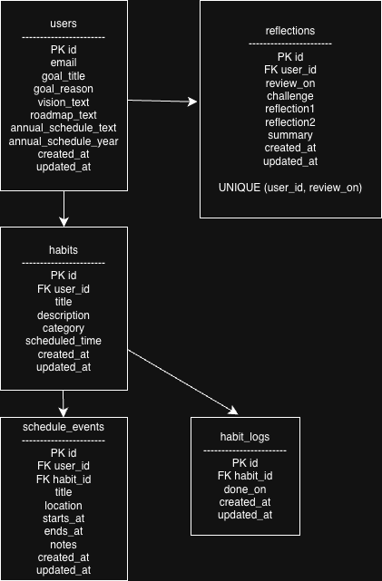

# DO DAILY.

## アプリケーション名
DO DAILY.  
You already know what to do.

---

## アプリケーション概要
「毎日やるべきことは分かっているのに、続かない」人のための  
**習慣管理 × 振り返り × 可視化** による自己管理アプリです。  
淡々と積み上げることに集中できる設計を重視しています。

---

## URL 
https://do-daily.onrender.com

---

## テスト用アカウント
- メールアドレス：test@test.com  
- パスワード：Yamate5124  

※ 本番環境ではテスト用アカウントは削除予定です。

---

## 利用方法

### 習慣の登録
1. 新規登録 / ログイン  
2. 習慣を作成（タイトル・内容）  
3. 毎日「実行したか」をワンタップで記録  

### 振り返りの記入
1. 日付を選択  
2. 今日の課題・振り返りを記入  
3. 保存すると日付ごとに蓄積  

### 振り返り検索
1. 日付検索 または キーワード検索  
2. 過去の振り返りを一覧で確認  
3. 習慣の実行率をグラフで確認  

---

## アプリケーションを作成した背景
学習や転職活動の中で、  
「目標はあるが、日々の行動が曖昧になりやすい」という課題を感じました。

ToDo 管理ではなく、  
**“行動 → 振り返り → 可視化” を毎日繰り返せる仕組み** が必要だと考え、  
自分自身が使い続けられることを前提に本アプリを開発しました。

---

## 洗い出した要件
- ユーザー認証機能  
- 習慣の登録・実行記録  
- 日付ごとの振り返り記録  
- キーワード・日付検索  
- 実行率の可視化（グラフ）  
- モバイルファーストな UI  

---

## 実装した機能について（画像 / GIF）
※ 今後 README に GIF を追加予定

- 習慣の作成・実行記録  
- 振り返りの記入・検索  
- 直近7日間の実行率表示  

---

## 実装予定の機能
- 振り返り内容の分析・要約  
- 習慣の継続率に応じたフィードバック  
- UI/UX のさらなる改善  

---

## データベース設計（ER図）



---

## 開発環境
- フロントエンド：HTML / CSS  
- バックエンド：Ruby on Rails 7  
- データベース：MySQL  
- 認証：Devise  
- インフラ：Render  

---

## ローカルでの動作方法

```bash
git clone https://github.com/ユーザー名/do-daily.git
cd do-daily
bundle install
rails db:create
rails db:migrate
rails s